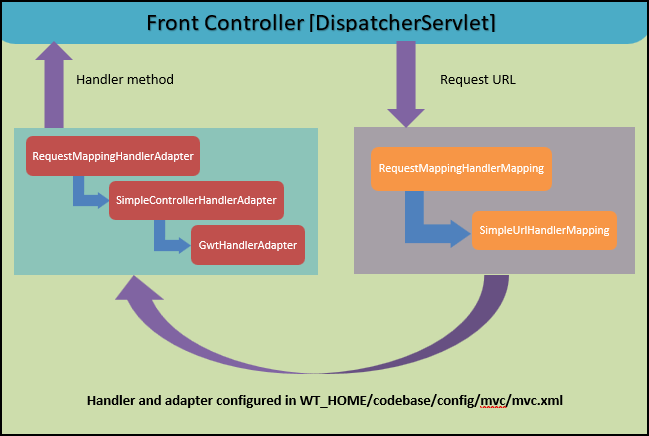

### Handler Adapter Interfaces

What Is a Handleradapter?

HandlerAdapter — Irrespective of what the handler is really called,
it helps the DispatcherServlet to call a handler mapped to a request

link: https://sivakumar-hybris-dev.medium.com/spring-framework-recap-mvc-module-864d5f89b224



The HandlerAdapter is basically an interface which facilitates the handling of HTTP requests in a very flexible manner
in Spring MVC.

It’s used in conjunction with the HandlerMapping, which maps a method to a specific URL.

The DispatcherServlet then uses a HandlerAdapter to invoke this method.
The servlet doesn’t invoke the method directly – it basically serves as a bridge between itself
and the handler objects, leading to a loosely coupling design.

```
org.springframework.web.servlet.HandlerAdapter

/**
* MVC framework SPI, allowing parameterization of the core MVC workflow.
*/
public interface HandlerAdapter {

	/**
	 * Given a handler instance, return whether this {@code HandlerAdapter}
	 * can support it. Typical HandlerAdapters will base the decision on the handler
	 * type. HandlerAdapters will usually only support one handler type each.
	 */
	boolean supports(Object handler);

	/**
	 * Use the given handler to handle this request.
	 * The workflow that is required may vary widely.
	 * @param request current HTTP request
	 * @param response current HTTP response
	 * @param handler the handler to use. This object must have previously been passed
	 * to the {@code supports} method of this interface, which must have
	 * returned {@code true}.
	 * @return a ModelAndView object with the name of the view and the required
	 * model data, or {@code null} if the request has been handled directly
	 * @throws Exception in case of errors
	 */
	@Nullable
	ModelAndView handle(HttpServletRequest request, HttpServletResponse response, Object handler) throws Exception;

}
```

The HandlerAdapter interface facilitates the use of controllers, servlets, HttpRequests, and HTTP paths
through several specific interfaces.
The HandlerAdapter interface thus plays an essential role through the many stages of the DispatcherServlet
request processing workflow.

First, each HandlerAdapter implementation is placed into HandlerExecutionChain from your dispatcher’s getHandler()
method.
Then, each of those implementations handle() the HttpServletRequest object as the execution chain proceeds.

link: https://www.baeldung.com/spring-dispatcherservlet

#### Init methods: initHandlerAdapters(context);

```
public class DispatcherServlet extends FrameworkServlet {

   ...........

	/**
	 * Initialize the strategy objects that this servlet uses.
	 * <p>May be overridden in subclasses in order to initialize further strategy objects.
	 */
	protected void initStrategies(ApplicationContext context) {
		initMultipartResolver(context);
		initLocaleResolver(context);
		initThemeResolver(context);
		
		// # 1: first
		initHandlerMappings(context);
		
		// # 2: second
		initHandlerAdapters(context);
		initHandlerExceptionResolvers(context);
		initRequestToViewNameTranslator(context);
		initViewResolvers(context);
		initFlashMapManager(context);
	}

}	
```

#### Types of HandlerAdapter

Once the mapping is found, it will find the suitable handler adapter from the configured adapters.
types of handler adapters:

link: https://www.baeldung.com/spring-mvc-handler-adapters

1. `RequestMappingHandlerAdapter` - REST Web
   This adapter class was introduced in Spring 3.1, deprecating the AnnotationMethodHandlerAdaptor handler adapter in
   Spring 3.2.
   It’s used with RequestMappingHandlerMapping class, which executes methods annotated with @RequestMapping.

   The RequestMappingHandlerMapping is used to maintain the mapping of the request URI to the handler.
   Once the handler is obtained, the DispatcherServlet dispatches the request to the appropriate handler adapter,
   which then invokes the handlerMethod().

3. `HandlerFunctionAdapter` - REST Reactive Webflux
   Simple adapter that lets DispatcherHandler invoke a HandlerFunction that was mapped to a request.
   link: https://docs.spring.io/spring-framework/reference/web/webflux-functional.html

3. `HttpRequestHandlerAdapter`
   This handler adapter is used for the handlers that process HttpRequests.
   It implements the HttpRequestHandler interface, which contains a single handleRequest()
   method for processing the request and generating the response.

4. `SimpleControllerHandlerAdapter`
   This is the default handler adapter registered by Spring MVC.
   It deals with classes implementing Controller interface and is used to forward a request to a controller object.
